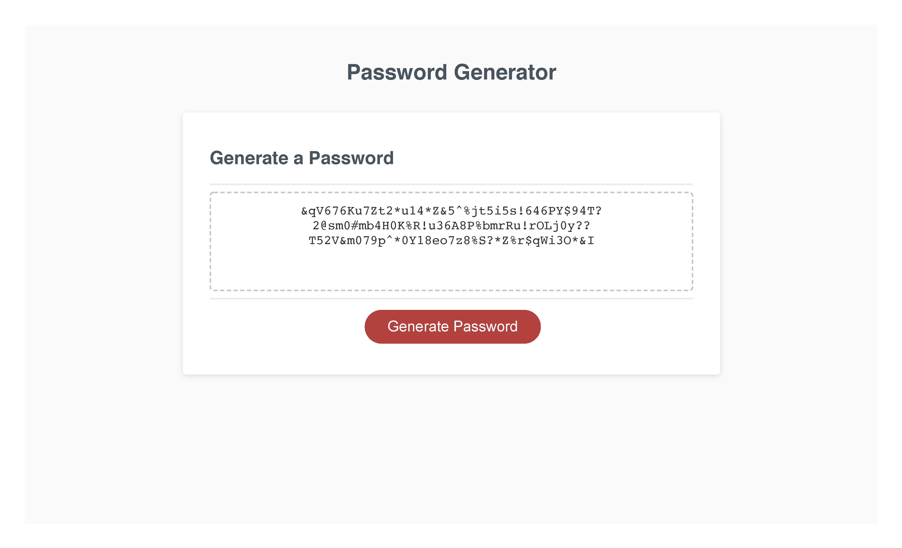

# Password-Generator-Challenge-3

## Description
This is the third challenge in the Northwestern Coding Bootcamp (Module 3). We, the students, were given completed html and css files, along with a very minimal js file, and we had to create a new function called generatePassword() that created and displayed a randomly generated password on the webpage after clicking the "Generate Password" button. This function would ask the user a series of questions to set parameters for the password, such as length of characters as well as type of characters used in the password. See the User Story and Acceptance Criteria below for more information on the project requirements.

## Link to live page
[Live Link](https://mbronstein1.github.io/Password-Generator-Challenge-3/)

## Screenshot


## User Story
```
AS AN employee with access to sensitive data
I WANT to randomly generate a password that meets certain criteria
SO THAT I can create a strong password that provides greater security
```

## Acceptance Criteria
```
GIVEN I need a new, secure password
WHEN I click the button to generate a password
THEN I am presented with a series of prompts for password criteria
WHEN prompted for password criteria
THEN I select which criteria to include in the password
WHEN prompted for the length of the password
THEN I choose a length of at least 8 characters and no more than 128 characters
WHEN asked for character types to include in the password
THEN I confirm whether or not to include lowercase, uppercase, numeric, and/or special characters
WHEN I answer each prompt
THEN my input should be validated and at least one character type should be selected
WHEN all prompts are answered
THEN a password is generated that matches the selected criteria
WHEN the password is generated
THEN the password is either displayed in an alert or written to the page
```